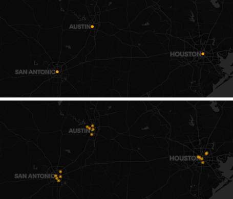

```{r setup, include=FALSE}
knitr::opts_chunk$set(echo = TRUE)
```

```{r, include=FALSE}
library(tidyverse)
library(ggmap)
library(leaflet)

myAPI <- read_file("C:\\Users\\gordo_000\\Google Drive\\Working\\R analysis\\API keys\\reddish_api.txt")
register_google(key = myAPI)
```

```{r pressure, echo=FALSE, fig.cap="Example of applying jitter", out.width = '40%'}

```

#### Overlapping spatial points can be hard to evaluate, and can also obscure clickable points in an interactive visualization. So, applying a little bit of jitter to them can help add some clarity and ease of use to your visualization.The point of this function is to add some random noise to the smaller decimal places of the latitude and longitude values for overlapping points, and to leave non-overlapping points alone. 


## The Function
```{r}
mutate_jitter_sp <- function(data, lat, long, decimal = 3){
  
   lat <- enquo(lat)
   long <- enquo(long)
  
need_change <- count(data, !!lat, !!long) %>%
    filter(n > 1) %>%
    mutate(change = 10^(-decimal))

i <- nrow(data)
j <- nrow(need_change)           
      
while (j >= 1) {
  
  data <- data %>%
    full_join(., need_change) %>%
    select(-n) %>%
    mutate(change = replace_na(change, 0)) %>%
    mutate(
      jitter_lat = !!lat + (change * runif(i, min = -10, max = 10)),
      jitter_long = !!long + (change * runif(i, min = -10, max = 10))
    ) %>% 
    select(-change)
  
need_change_check <- count(data, jitter_lat, jitter_long) %>%
    filter(n > 1) 

j <- nrow(need_change_check) 

      }
   return(data)  
}
```
The function itself relies on a while loop that will add random noise to overlapping points until all points are unique. 

# Interactive Example
```{r message = FALSE}
cities <- tribble(
  ~city, ~info,
  "Austin", "Unique Information A",
  "Austin", "Unique Information B",
  "Austin", "Unique Information C",
  "Austin", "Unique Information D",
  "Austin", "Unique Information E",
  "Houston", "Unique Information F",
  "Houston", "Unique Information G",
  "Houston", "Unique Information H",
  "Houston", "Unique Information I",
  "Houston", "Unique Information J",
  "Houston", "Unique Information K",
  "San Antonio", "Unique Information L",
  "San Antonio", "Unique Information M",
  "San Antonio", "Unique Information N",
  "San Antonio", "Unique Information O",
  "San Antonio", "Unique Information P"
) %>%  mutate_geocode(city)

cities_jitter <- cities %>% 
  mutate_jitter_sp(lat = lat, long = lon, decimal = 2)

```

### No Jitter
Notice how the unique information is only accessible for the top most data point no matter how much you zoom. 
```{r echo =FALSE}
map <- leaflet(width = "100%", height = 250) %>%
  addProviderTiles('CartoDB.DarkMatter') %>% 
    addCircles(data = cities, ~lon, ~lat, weight = 5, radius=40, 
               color="#ffa500", stroke = TRUE, fillOpacity = 0.8,
               popup = ~paste(info)) %>%
  setView(-96.911018, 29.867597, zoom = 7)

map
```

### With Jitter
All points are now clickable. 
```{r echo = FALSE}
map_jitter <- leaflet(width = "100%", height = 250) %>%
  addProviderTiles('CartoDB.DarkMatter') %>% 
    addCircles(data = cities_jitter, ~jitter_long, ~jitter_lat, weight = 5, radius=40,
               color="#ffa500", stroke = TRUE, fillOpacity = 0.8,
               popup = ~paste(info)) %>%
  setView(-96.911018, 29.867597, zoom = 7)

map_jitter
```


# Simple Example
First we need to make a dataframe with *some* overlapping x and y points. 
```{r}

df <- tribble(
 ~x, ~y,
 9, 8,
 2, 8,
 2, 8,
 2, 8,
 2, 3,
 1, 4,
 2, 3,
 5, 8
)

```

The function only asks that you define the data, the latitude and longitude columns, and what decimal place to adjust.
```{r message = FALSE}

df <- df %>% 
  mutate_jitter_sp(lat = x, long = y, decimal = 2)

```

The function will add the jitter_lat and jitter_long columns with new unique values for points that used to overlap and untouched values for the unique points. 
```{r echo= FALSE}
print(df)
```
